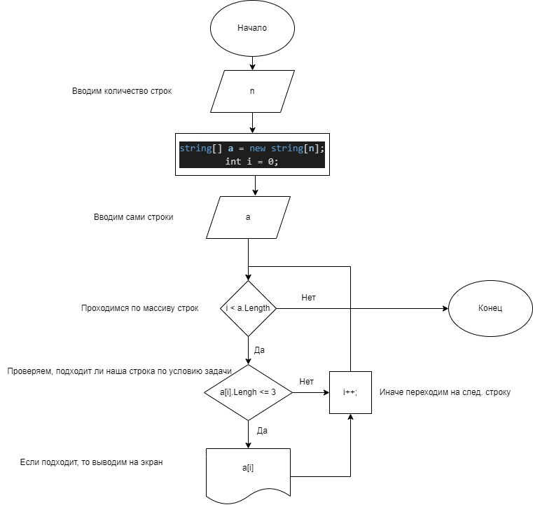

# Контрольная работа за 1 четверть

## Задача
Написать программу, которая из имеющегося массива строк формирует массив из строк, длина которых меньше либо равна 3 символа. Первоначальный массив можно ввести с клавиатуры, либо задать на старте выполнения алгоритма. При решении не рекомендуется пользоваться коллекциями, лучше обойтись исключительно массивами.

## Алгоритм решения задачи
1) На вход получаем массив строк
2) Проверяем длину строки
3) Если <= 3, то выводим строку
4) Иначе переходим на следующую строку

## Блок схема
